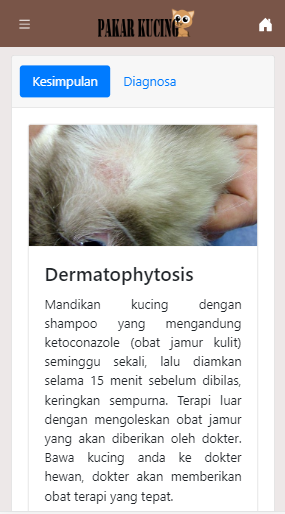

# pakar-kucing
Sistem pakar untuk mendiagnosa penyakit kulit kucing di sertai terapi penyembuhan dan cara pengobatannya

Sistem pakar ini merupakan skripsi saya yang di buat di tahun 2017 dengan kode [E-ISSN: 2527-6514](https://ejournal.nusamandiri.ac.id/index.php/pilar/article/view/81/68) yang belum sempat di publish, kini saya buat ulang dengan Vue agar mudah di deploy kembali.

Di dalam sistem pakar ini beberapa penyakit kulit yang sering di alami kucing diantaranya : dermatophytosis, scabies, pyoderma, infestasi kutu, dan felice acne. Gejala yang terjadi sudah di tentukan dari penyakit tersebut, diagnosa dilakukan dengan beberapa gejala yang mendekati dengan penyakit yang ada.

Sekian untuk informasi mengenai sistem pakar ini semoga bermanfaat :D

Ambil paket yang di gunakan
```bash
npm install
```

Jalankan melalui npm
```bash
npm run serve
```

Tampilan

[](./../../)

[](./../../)

[](./../../)
